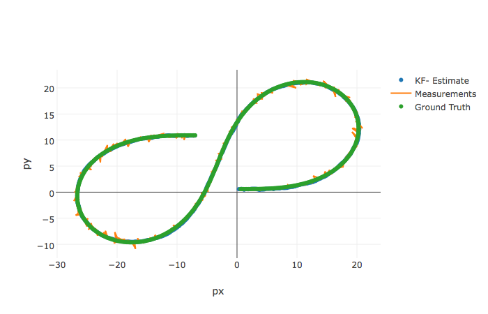

# Project Unscented Kalman Filters

Hand-in for the project Unscented Kalman Filter in Self-Driving Car Engineer Nanodegree Program.

Enclosed is my code and data files for my project on Unscented Kalman Filters.

## To run the compiled code
The code should compile. I have used Xcode 8.3.2 in the project, with the Xcode project file generated by cmake.


The command to run the program is: `./UnscentedKF ../../data/obj_pose-laser-radar-synthetic-input.txt ../../data/obj_pose-laser-radar-synthetic-output.txt`

## RMSE
The RSME for the sample data was:
```
0.0699425
0.0831537
0.340431
0.227086
```
## Code
I modified the code, using code snippets from the quizzes. I addition I had to use the formulas and comments from the lectures to add code for radar initialisation and update function.

I used the NIS values to adjust the noise parameters.

## Additional tools used for verification
I modified the visualisation tools from Mercedes to plot the path.



I also plot the NIS both for Lidar and Radar as they have different numbers of sensor signal and therefore also different 96% percentile in the chi-squared distribution, (7.815 for 3 sensors, and 5.991 for 2).

The final lidar plot I get is:


The final radar plot I get is:


